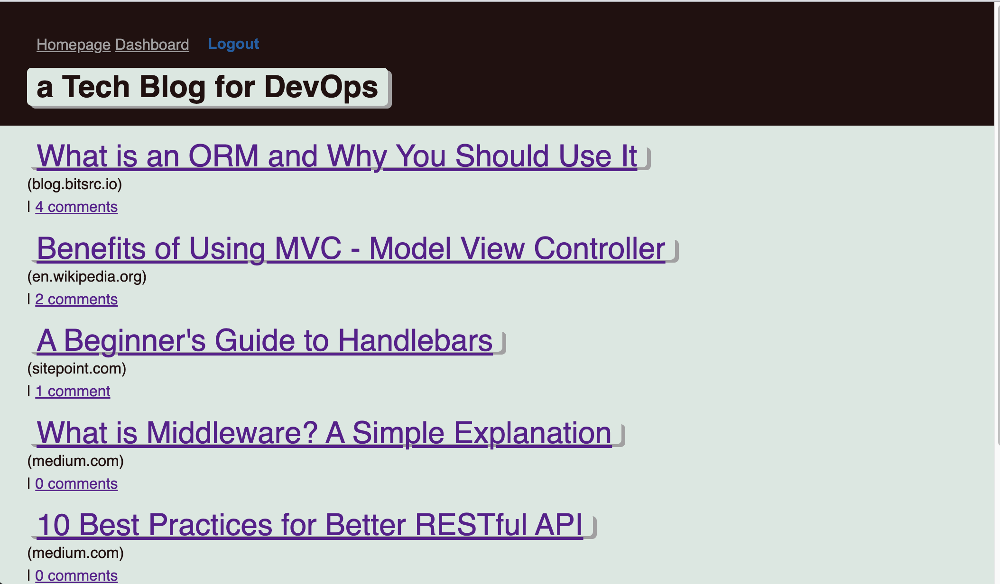

 
##  a Tech Blog for DevOps
 

This project demonstrates the use of MVC to build a CMS-style technical blog site.  

The link to the deployed application is here:

[Repository for this Project](https://github.com/trfina/tech-blog)
[Heroku Location for this App](https://pure-shore-75804.herokuapp.com/)

## Table of Contents
* [Installation](#installation)
* [Usage](#usage)
* [Contributing](#contributing)
* [Credits](#credits)
* [License](#license)
* [Questions](#questions)

## Installation

## Usage
`npm start` will start the application

## Contributing
[Contributor Covenant](https://www.contributor-covenant.org/) 
    
## License
- This application is covered under the following license: MIT License
  

## Features

- If your project has a lot of features, consider adding a heading called "Features" and listing them there

## Questions

GitHub Username:
  
- [GitHub Profile](https://github.com/trfina)
- Additional Questions?  
Contact me at finatammy@gmail.com

 This README was generated with ❤️ by Tammy Fina © 2022
